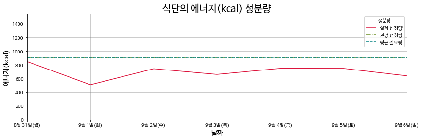
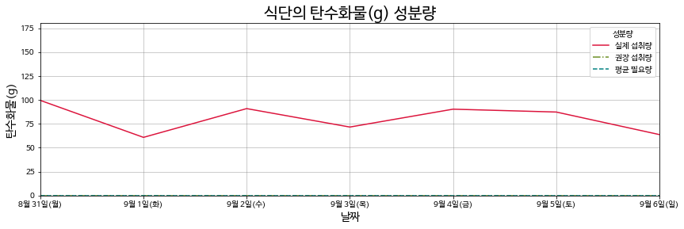
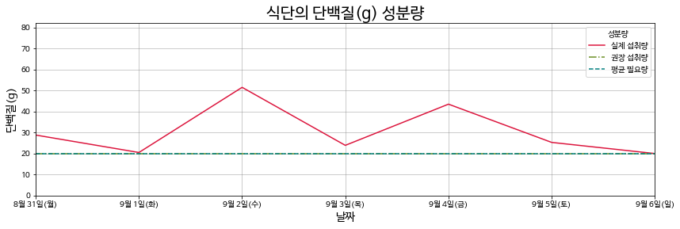
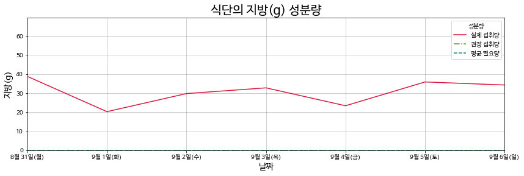
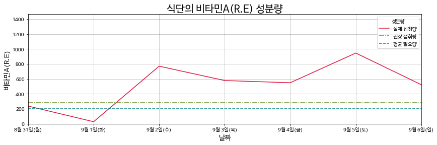
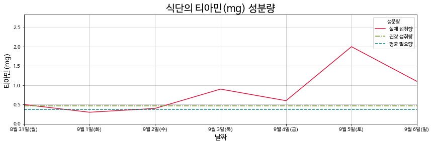
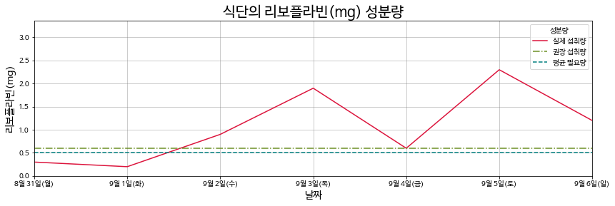
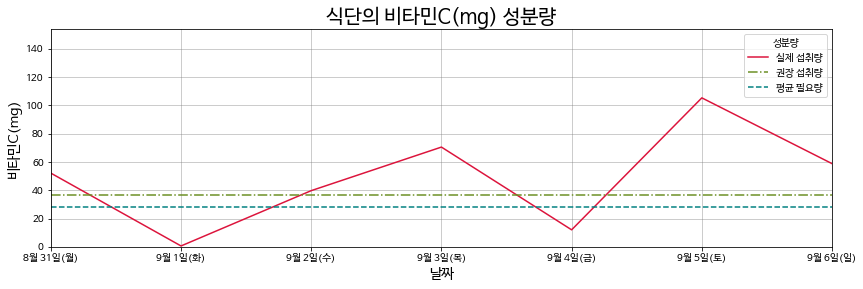
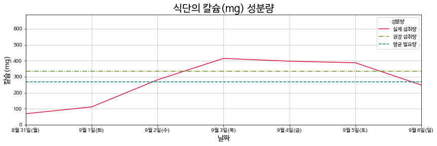
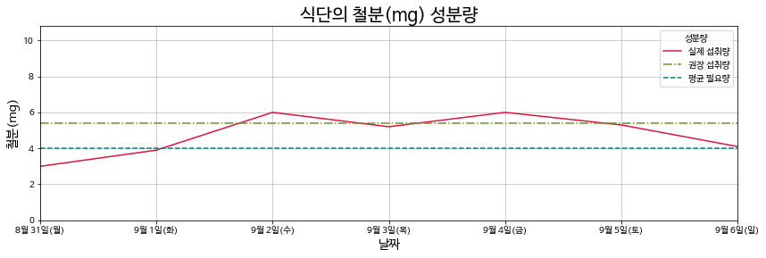

```python
import requests
from bs4 import BeautifulSoup
```


```python
# !pip install selenium
```


```python
from selenium import webdriver
import time


menu = dict()
for i in range(1, 8):
    html = requests.get(f'http://dsmhs.djsch.kr/boardCnts/list.do?type=default&page={i}&m=020503&s=dsmhs&boardID=54797')
    soup = BeautifulSoup(html.text, 'html.parser')
    for tr in soup.select_one('div.cntBody table').select('tbody tr'):
        k = ' / '.join([tr.select('td')[-1].text, tr.select_one('td a').text.lstrip()])
        v = tr.select_one('td a')['onclick'].split(':')[-1]
        if '식단표' in k:    # 식단표면 skip
            continue
        menu.update({k: v})
```


```python
print(*[f'[{i:2>}] {n}' for i, n in enumerate(menu)], sep='\n')
word = input("\n [!] 어떤 달의 식단을 분석할지 입력하세요 \n(2020년 9월이면 '2020년 9월', 2020년 방학이면 '2020년 여름방학'과 같이 입력) : ")
# word = '2020년 9월'
y, m = word.split(' ')
func = None
for i in menu:
    if y[:-1] in i and m in i:
        func = menu[i]
        break

file = ''
if func:
    try:
        options = webdriver.ChromeOptions()
        options.add_argument('headless')
        driver = webdriver.Chrome(r"C:\Users\user\Documents\chromedriver.exe", options=options)
#        driver = webdriver.Chrome(r"C:\Users\user\Documents\chromedriver.exe")
        driver.get('http://dsmhs.djsch.kr/boardCnts/list.do?type=default&page=1&m=020503&s=dsmhs&boardID=54797')
        time.sleep(2)
        driver.execute_script(func)
        time.sleep(3)
        soup = BeautifulSoup(driver.page_source, 'html.parser')
        file = 'http://dsmhs.djsch.kr' + soup.select_one('article.board-text div.fieldBox dd a')['href']
    finally:
        driver.close()
```

    [0] 2020-08-18 / 9월 식재료 원산지 및 영양표시제
    [1] 2020-08-14 / 여름방학 식재료 원산지 및 영양표시제
    [2] 2020-08-02 / 8월 식재료 원산지 및 영양표시제
    [3] 2020-06-24 / 7월 식재료 원산지 및 영양표시제
    [4] 2020-05-31 / ​6월 식재료 원산지 및 영양표시제
    [5] 2020-05-18 / ​5월 식재료 원산지 및 영양표시제
    [6] 2019-11-27 / 12월~1월 식재료 원산지 및 영양표시제
    [7] 2019-10-23 / 11월 식재료 원산지 및 영양표시제
    [8] 2019-09-26 / 10월 식재료 원산지 및 영양표시제
    [9] 2019-08-25 / 9월 식재료 원산지 및 영양표시제
    [10] 2019-07-23 / 8월 식재료 원산지 및 영양표시제
    [11] 2019-06-27 / 7월 식재료 원산지 및 영양표시제
    [12] 2019-05-24 / 6월 식재료 원산지 및 영양표시제
    [13] 2019-04-30 / 5월 식재료 원산지 및 영양표시제
    [14] 2019-04-30 / 4월 식재료 원산지 및 영양표시제
    [15] 2019-02-22 / 3월 식재료원산지 및 영양표시제
    [16] 2018-12-23 / 2019년 1 - 2월 학교급식 식재료원산지 및 영양...
    [17] 2018-11-24 / 12월 학교급식 식재료 원산지 및 영양표시제
    [18] 2018-10-18 / 11월 학교급식 식재료 원산지 및 영양표시제
    [19] 2018-09-19 / 10월 학교급식 식재료 원산지 및 영양표시제
    [20] 2018-08-26 / 9월 학교급식 식재료 원산지 및 영양표시제
    [21] 2018-08-14 / 8월 학교급식 식재료 원산지 및 영양표시제
    [22] 2017-08-21 / 8월21일-9월 학교급식식재료 원산지 및 영양표...
    [23] 2017-07-04 / 7월 학기중 학교급식식재료 원산지 및 영양표...
    [24] 2017-05-26 / 6월 학교급식 식재료 원산지 및 영양표시제(...
    [25] 2017-04-21 / 5월 학교급식식재료 원산지 및 영양표시제
    [26] 2017-03-26 / 4월 학교급식 식재료원산지 및 영양표시제
    [27] 2017-03-03 / 3월 학교급식 식재료원산지 및 영양표시제
    


```python
import pandas as pd

print(file)
xl=pd.ExcelFile(file)
meal_li = []
for meal in ['조식', '중식', '석식']:
    li = []
    for i in range(len(xl.parse(meal))//38):
        df = xl.parse(meal)[i*39:(i+1)*39+1]
        del df['Unnamed: 8']
        li.append(df)
    meal_li.append(li)
# choice = input('[!] 무슨 작업을 하실 것인지 아래의 선택지 중 선택하세요'
#               '\n(특정 날짜 식단 분석 -> 1, 특정 주간 식단 분석 -> 2, 월 전체 식단 분석 -> 3)\n(숫자를 입력하세요) : ')
```

    http://dsmhs.djsch.kr/boardCnts/fileDown.do?m=020503&s=dsmhs&fileSeq=9091907cac8102e71183c1cdbe853b2e
    


```python
# 전처리
tail = meal_li[0][0].tail(12).head(11)
del tail['Unnamed: 2']
yong = tail.T[1:4]
yong.index = tail.T[1:4][28]
yong.columns = tail['학교급식 식재료 원산지 및 영양표시제']
del yong['영양소']
yong = yong.fillna(0)

day_x = meal_li[0][0][1:2].T[5:12]
yong
```


<div>
<style scoped>
    .dataframe tbody tr th:only-of-type {
        vertical-align: middle;
    }

    .dataframe tbody tr th {
        vertical-align: top;
    }

    .dataframe thead th {
        text-align: right;
    }
</style>
<table border="1" class="dataframe">
  <thead>
    <tr style="text-align: right;">
      <th>학교급식 식재료 원산지 및 영양표시제</th>
      <th>에너지(kcal)</th>
      <th>탄수화물(g)</th>
      <th>단백질(g)</th>
      <th>지방(g)</th>
      <th>비타민A(R.E)</th>
      <th>티아민(mg)</th>
      <th>리보플라빈(mg)</th>
      <th>비타민C(mg)</th>
      <th>칼슘(mg)</th>
      <th>철분(mg)</th>
    </tr>
    <tr>
      <th>28</th>
      <th></th>
      <th></th>
      <th></th>
      <th></th>
      <th></th>
      <th></th>
      <th></th>
      <th></th>
      <th></th>
      <th></th>
    </tr>
  </thead>
  <tbody>
    <tr>
      <th>평균\n필요량</th>
      <td>900</td>
      <td>0.0</td>
      <td>20.0</td>
      <td>0.0</td>
      <td>200.0</td>
      <td>0.37</td>
      <td>0.5</td>
      <td>28.4</td>
      <td>267.0</td>
      <td>4.0</td>
    </tr>
    <tr>
      <th>권장\n섭취량</th>
      <td>900</td>
      <td>0.0</td>
      <td>20.0</td>
      <td>0.0</td>
      <td>284.0</td>
      <td>0.47</td>
      <td>0.6</td>
      <td>36.7</td>
      <td>334.0</td>
      <td>5.4</td>
    </tr>
    <tr>
      <th>주평균\n섭취량</th>
      <td>-22</td>
      <td>45.5</td>
      <td>18.5</td>
      <td>35.9</td>
      <td>432.2</td>
      <td>0.50</td>
      <td>0.8</td>
      <td>35.0</td>
      <td>254.5</td>
      <td>4.8</td>
    </tr>
  </tbody>
</table>
</div>


```python
# choice = 2
if choice == 2:
    wek = int(input("원하는 주를 입력하세요 (첫번째 주면 '1'입력) : "))
    ran = int(input('선택지를 선택하세요\n(조식 분석 -> 1, 중식 분석 -> 2, 석식 분석 -> 3)\n(숫자를 입력하세요) : '))
    daily_yong = None
    for i in range(ran-1, ran):
        days = meal_li[i][wek-1].T.tail(7)
        del days[0]
        days.index = days[1]
        del days[1]
        daily_yong = days.T[27:37]
        daily_yong.index = yong.columns
daily_yong
```

    원하는 주를 입력하세요 (첫번째 주면 '1'입력) : 1
    선택지를 선택하세요
    (조식 분석 -> 1, 중식 분석 -> 2, 석식 분석 -> 3)
    (숫자를 입력하세요) : 1
    


<div>
<style scoped>
    .dataframe tbody tr th:only-of-type {
        vertical-align: middle;
    }

    .dataframe tbody tr th {
        vertical-align: top;
    }

    .dataframe thead th {
        text-align: right;
    }
</style>
<table border="1" class="dataframe">
  <thead>
    <tr style="text-align: right;">
      <th>1</th>
      <th>8월 31일(월)</th>
      <th>9월 1일(화)</th>
      <th>9월 2일(수)</th>
      <th>9월 3일(목)</th>
      <th>9월 4일(금)</th>
      <th>9월 5일(토)</th>
      <th>9월 6일(일)</th>
    </tr>
    <tr>
      <th>학교급식 식재료 원산지 및 영양표시제</th>
      <th></th>
      <th></th>
      <th></th>
      <th></th>
      <th></th>
      <th></th>
      <th></th>
    </tr>
  </thead>
  <tbody>
    <tr>
      <th>에너지(kcal)</th>
      <td>848.4</td>
      <td>509.7</td>
      <td>742.9</td>
      <td>660.7</td>
      <td>748.3</td>
      <td>747.2</td>
      <td>639.7</td>
    </tr>
    <tr>
      <th>탄수화물(g)</th>
      <td>99.6</td>
      <td>60.9</td>
      <td>91</td>
      <td>71.7</td>
      <td>90.4</td>
      <td>87.4</td>
      <td>63.8</td>
    </tr>
    <tr>
      <th>단백질(g)</th>
      <td>28.8</td>
      <td>20.5</td>
      <td>51.5</td>
      <td>23.9</td>
      <td>43.5</td>
      <td>25.3</td>
      <td>20</td>
    </tr>
    <tr>
      <th>지방(g)</th>
      <td>38.8</td>
      <td>20.3</td>
      <td>29.8</td>
      <td>32.8</td>
      <td>23.4</td>
      <td>35.9</td>
      <td>34.3</td>
    </tr>
    <tr>
      <th>비타민A(R.E)</th>
      <td>236.9</td>
      <td>27.1</td>
      <td>770.2</td>
      <td>578</td>
      <td>548.7</td>
      <td>945.9</td>
      <td>521.9</td>
    </tr>
    <tr>
      <th>티아민(mg)</th>
      <td>0.5</td>
      <td>0.3</td>
      <td>0.4</td>
      <td>0.9</td>
      <td>0.6</td>
      <td>2</td>
      <td>1.1</td>
    </tr>
    <tr>
      <th>리보플라빈(mg)</th>
      <td>0.3</td>
      <td>0.2</td>
      <td>0.9</td>
      <td>1.9</td>
      <td>0.6</td>
      <td>2.3</td>
      <td>1.2</td>
    </tr>
    <tr>
      <th>비타민C(mg)</th>
      <td>52.1</td>
      <td>0.6</td>
      <td>39.7</td>
      <td>70.5</td>
      <td>12</td>
      <td>105.3</td>
      <td>58.8</td>
    </tr>
    <tr>
      <th>칼슘(mg)</th>
      <td>68.6</td>
      <td>111.3</td>
      <td>280.8</td>
      <td>414.5</td>
      <td>397.2</td>
      <td>387.3</td>
      <td>248</td>
    </tr>
    <tr>
      <th>철분(mg)</th>
      <td>3</td>
      <td>3.9</td>
      <td>6</td>
      <td>5.2</td>
      <td>6</td>
      <td>5.3</td>
      <td>4.1</td>
    </tr>
  </tbody>
</table>
</div>


```python
import matplotlib.pyplot as plt

plt.rc('font', family='NanumBarunGothic')
plt.rcParams["figure.figsize"] = (14,4)
for i in range(10):
    plt.axis([0, 6, 0, daily_yong.iloc[i].mean() + daily_yong.iloc[i].max()])
    plt.plot(daily_yong.columns, daily_yong.iloc[i], '-', c='crimson', label='실제 섭취량')
    plt.plot(daily_yong.columns, [yong.iloc[1][daily_yong.index[i]]] * 7, '-.', c='olivedrab', label='권장 섭취량')
    plt.plot(daily_yong.columns, [yong.iloc[0][daily_yong.index[i]]] * 7, '--', c='teal', label='평균 필요량')
    plt.grid(True, color='gray', alpha=0.5)
    plt.legend(loc="best", title='성분량')
    plt.xlabel('날짜',fontsize=14)
    plt.ylabel(daily_yong.index[i],fontsize=14)
    plt.title(f'식단의 {daily_yong.index[i]} 성분량',fontsize='20')
    plt.savefig(f'{word} {wek} {daily_yong.index[i]}.png')
    plt.show()
```































